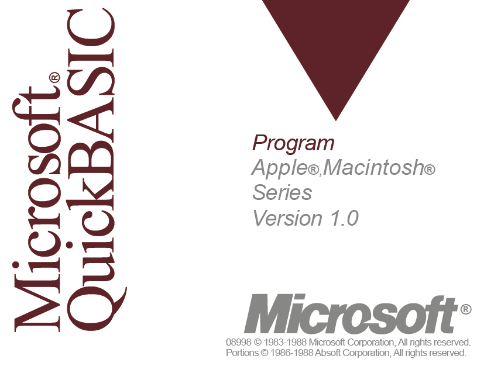
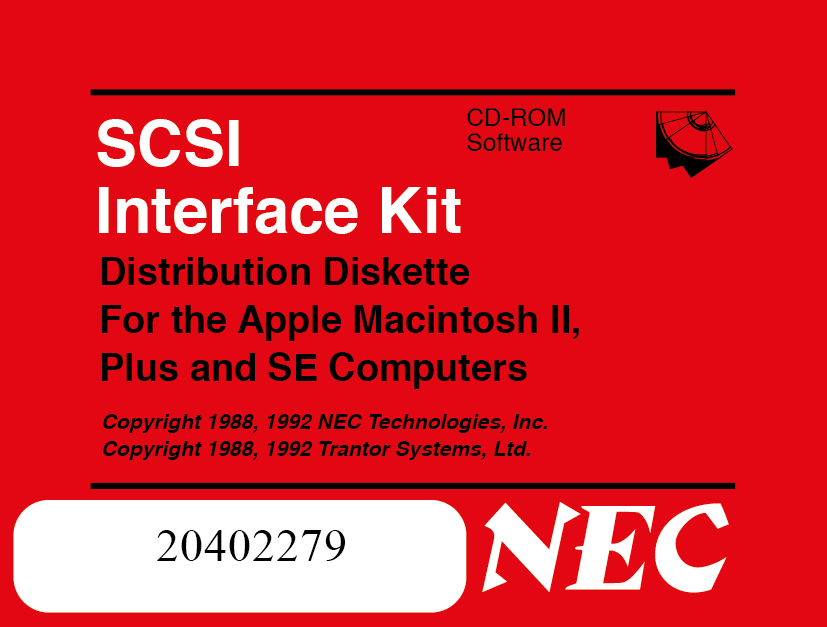

# Floppy Disk Labels

A template for 3½-inch floppy disk labels and examples thereof, made in Adobe Illustrator. The template includes trim and bleed allowances to allow for professional printing.

These labels were created to be used with a set of drinks coasters made from old floppy disks with a cork backing applied to stop them slipping. The original paper labels soon broke down from damp and abrasion so these were printed in matte laminated vinyl.

---

## Examples

<figure>
    
    <figcaption>Microsoft QuickBASIC</figcaption>
</figure>

<figure>
    
    <figcaption>NEC SCSI Interface Kit</figcaption>
</figure>
